<div align="center">
  
</div>

```text
If it's sloppy, unsafe, or fake-scalable, I'm not interested.
If it ships and holds up under pressure, let's talk.
```

<div align="center">
  <a href="https://daniel-eportfolio.web.app"></a>
  <a href="https://www.linkedin.com/in/daniel-sin-1881ske89"></a>
  
  
</div>

---

## `$ whoami`

Cloud Infrastructure Engineer & AI/ML Systems Architect. I build security infrastructure that doesn't fake it — RAG threat intel pipelines, cloud security posture monitors, LLM-powered log analyzers, SOAR platforms. Based in **New York, NY**.

Certs don't mean much without receipts. The repos are the receipts.

---

## `$ ls ./flagship/`

> The work I'd put in front of any hiring committee.

| Project | What it does | Grade |
|---------|-------------|-------|
| [**VectorGuard**](https://github.com/sinCodes11/vectorguard) | RAG-powered threat intelligence platform — ingests CVE feeds, threat reports, and IOCs into pgvector; query via FastAPI | A+ |
| [**OpsCentral**](https://github.com/sinCodes11/opscentral) | Unified SOC dashboard — FastAPI + Celery + Grafana + Prometheus, production Docker deploy | A+ |
| [**LogMind**](https://github.com/sinCodes11/logmind) | LLM-powered log analyzer — Sigma rule correlation, MITRE ATT&CK mapping, Redis pipeline | A+ |
| [**dont-get-hacked-hermes**](https://github.com/sinCodes11/dont-get-hacked-hermes) | VPS hardening guide for multi-agent Hermes deployments — UFW, fail2ban, SSH, systemd isolation, credential management per profile | A |
| [**60SEPP**](https://github.com/sinCodes11/60SEPP) | Offensive security tool portfolio — C++ implementations, builder mindset applied to red team tooling | A |

---

## `$ ls ./projects/`

<details>
<summary><b>Security & Cloud</b></summary>

| Project | Stack |
|---------|-------|
| [CloudSentry](https://github.com/sinCodes11/cloudsentry) — OCI CSPM | OCI SDK, Python, CIS Benchmarks, Grafana |
| [SecureFlow](https://github.com/sinCodes11/secureflow) — SOAR Orchestrator | n8n, VirusTotal, Webhooks, Docker |
| [OpenCyb3r](https://github.com/sinCodes11/OpenCyb3r) — Cybersecurity Tool Suite | Python, modular offensive/defensive tooling |
| [DMARC Agent](https://github.com/sinCodes11/dmarc-agent) — Email Auth CLI | Python, SPF/DKIM/DMARC, FastAPI |

</details>

<details>
<summary><b>AI / Autonomous Agents</b></summary>

| Project | Stack |
|---------|-------|
| Hermes Multi-Agent Gateway | Python, systemd, Telegram Bot API, RSA-PSS, OpenRouter |
| Elaine — Bug Bounty Recon Agent | subfinder, httpx, nuclei, NVD API, CISA KEV |
| KalshiAlerts — Prediction Market Trading Bot | Kalshi API, Alpaca API, SEC EDGAR, signal scoring |
| [Predictive Analytics Pipeline](https://github.com/sinCodes11/Predictive-Analytics-Pipeline) | Python, ML pipeline, feature engineering |

</details>

<details>
<summary><b>Other</b></summary>

| Project | Stack |
|---------|-------|
| [PocketPoker](https://github.com/sinCodes11/PocketPoker) — GTO Training App | React Native, TypeScript, Expo |
| [Sigil](https://github.com/sinCodes11/sigil) — Content Queue | TypeScript |

</details>

---

## `$ certs`

| Certification | Issued |
|---------------|--------|
| OCI Data Science Professional | Oct 2025 |
| OCI Generative AI Professional | Oct 2025 |
| OCI AI Foundations Associate | Sep 2025 |
| TryHackMe Junior Penetration Tester | May 2025 |
| Google Cybersecurity Professional Certificate | Feb 2025 |

---

<details>
<summary><code>$ skills --expand</code></summary>

| Domain | Tech |
|--------|------|
| Cloud | OCI, AWS, GCP, Docker, Kubernetes |
| AI/ML | RAG Pipelines, Vector DBs, LLM Integration, Claude API, Ollama, Multi-Agent Systems |
| Security | Pentesting, Burp Suite, Wireshark, Splunk, SIEM, Sigma, subfinder, nuclei, httpx |
| Automation | n8n, Python, Bash, JavaScript, PostgreSQL, systemd |
| FinTech | Kalshi API, Alpaca API, SEC EDGAR, RSA-PSS Auth, Signal Scoring |

</details>

---

<div align="center">


[](https://git.io/streak-stats)

[](https://tryhackme.com/p/DirtTrys)

</div>

---

<div align="center">
  
</div>
